# Squarepusher - Terminal Slam の MV のロケ地は？

<iframe width="560" height="315" src="https://www.youtube.com/embed/GlhV-OKHecI?si=rTZbVznGm5PHQOGf" title="YouTube video player" frameborder="0" allow="accelerometer; autoplay; clipboard-write; encrypted-media; gyroscope; picture-in-picture; web-share" referrerpolicy="strict-origin-when-cross-origin" allowfullscreen></iframe>

> 本作ではDiminished Reality, Mixed Realityを駆使することで、街中の広告を消去、もしくはSquarepusher由来の広告に入れ替え、破壊的な世界を作り出した。
>
> [Squarepusher “Terminal Slam” MV ｜ Daito Manabe](https://daito.ws/archive/squarepusher-terminal-slam-mv/)

どこを見ても広告だらけ、アテンション・エコノミーの極致といえる現代の東京を題材にした MV。

だいたいの場所はわかるが、はたして全てのシーンの場所を特定できるのか、なんとなく関心があったので休日をこれに費やすことにした。
Google ストリートビューで探す。
いいアングルが見つからない場合は、そのうち現地に行ってみる。

## 0:00 渋谷・スクランブル交差点

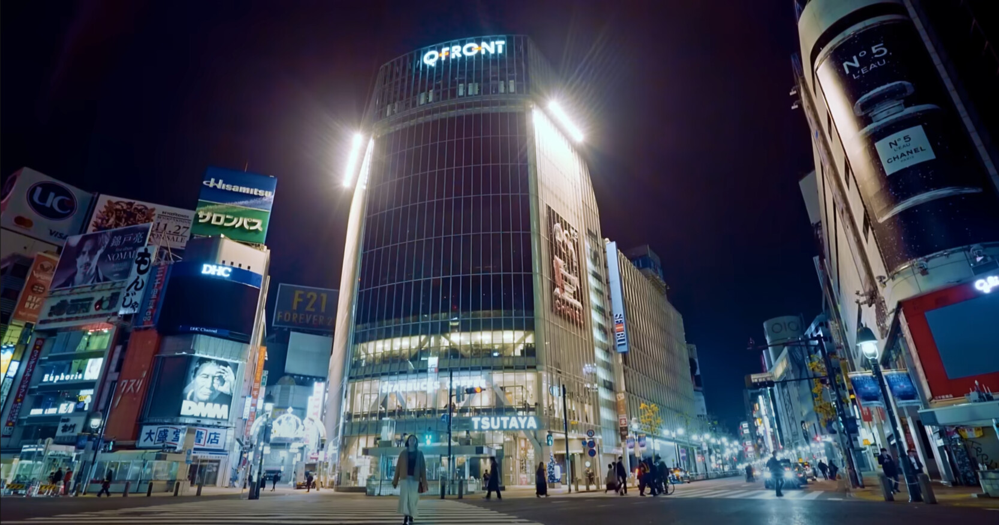

<iframe src="https://www.google.com/maps/embed?pb=!4v1757851129844!6m8!1m7!1sU1dw6m6lIr5GNwqWxljLng!2m2!1d35.65945296499401!2d139.7006053197404!3f340.06!4f24.159999999999997!5f0.7820865974627469" width="600" height="450" style="border:0;" allowfullscreen="" loading="lazy" referrerpolicy="no-referrer-when-downgrade"></iframe>

## 0:17 渋谷・宮益坂下交差点

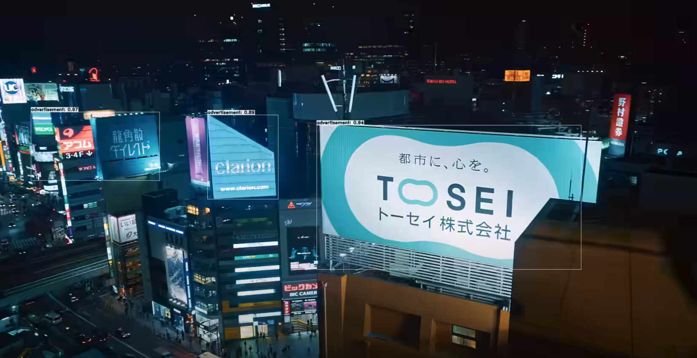

<iframe src="https://www.google.com/maps/embed?pb=!4v1757851280563!6m8!1m7!1sscGA00lz4GHmMmc_YGnCWg!2m2!1d35.65956443575516!2d139.7027554527438!3f295.56!4f1.9099999999999966!5f0.7820865974627469" width="600" height="450" style="border:0;" allowfullscreen="" loading="lazy" referrerpolicy="no-referrer-when-downgrade"></iframe>

## 0:22 渋谷・センター街

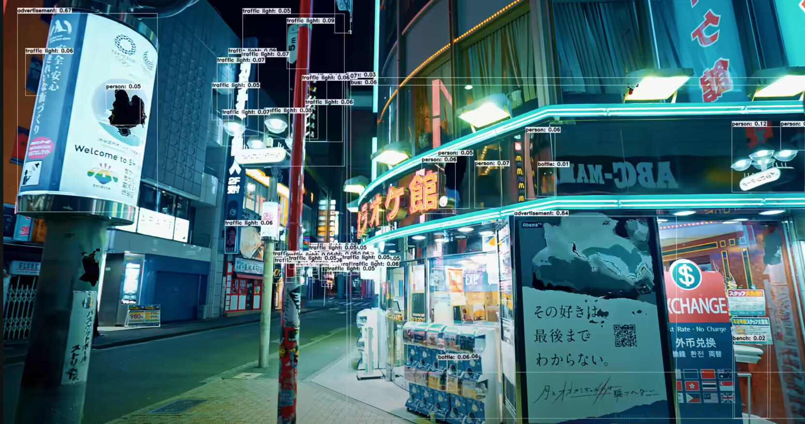

<iframe src="https://www.google.com/maps/embed?pb=!4v1757851524003!6m8!1m7!1sTvvagyXwhVRjVtfzsLcDfg!2m2!1d35.66038965899011!2d139.6986311025723!3f26.31!4f11.25!5f0.7820865974627469" width="600" height="450" style="border:0;" allowfullscreen="" loading="lazy" referrerpolicy="no-referrer-when-downgrade"></iframe>

## 0:27 渋谷・道玄坂下交差点

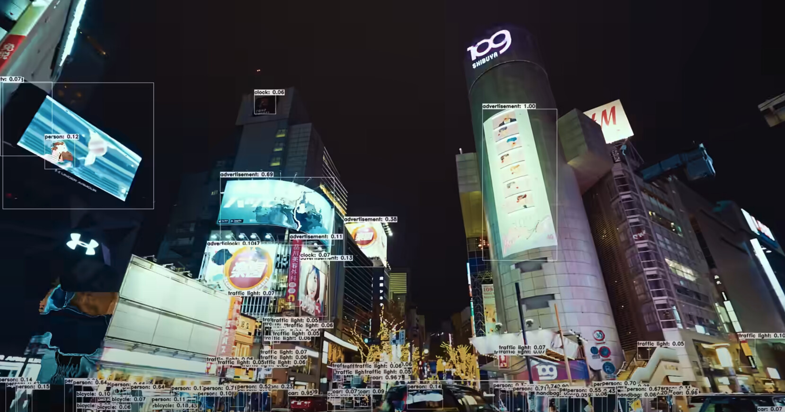

<iframe src="https://www.google.com/maps/embed?pb=!4v1757851642934!6m8!1m7!1sXRJfSWqAE9_bxcylVioCtQ!2m2!1d35.65958218644753!2d139.6994422843835!3f239.12!4f28.689999999999998!5f0.7820865974627469" width="600" height="450" style="border:0;" allowfullscreen="" loading="lazy" referrerpolicy="no-referrer-when-downgrade"></iframe>

## 0:32 渋谷・スクランブル交差点

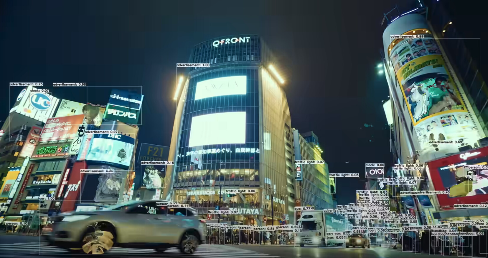

<iframe src="https://www.google.com/maps/embed?pb=!4v1757851868956!6m8!1m7!1sYavwMTlULqn8-gUx5TJH1A!2m2!1d35.65949322433579!2d139.700615058544!3f336.43!4f27.53!5f0.7820865974627469" width="600" height="450" style="border:0;" allowfullscreen="" loading="lazy" referrerpolicy="no-referrer-when-downgrade"></iframe>

## 0:38 渋谷・宮益坂下交差点付近

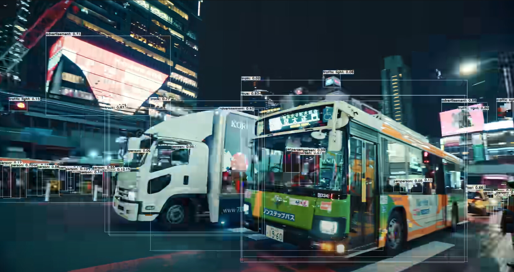

<iframe src="https://www.google.com/maps/embed?pb=!4v1757851943876!6m8!1m7!1sfdJ1nwB6UBLf_vmf7cG7TA!2m2!1d35.65953656564968!2d139.7022255670757!3f213.81!4f7.1299999999999955!5f0.7820865974627469" width="600" height="450" style="border:0;" allowfullscreen="" loading="lazy" referrerpolicy="no-referrer-when-downgrade"></iframe>

## 0:40 渋谷・スクランブル交差点 (上空)

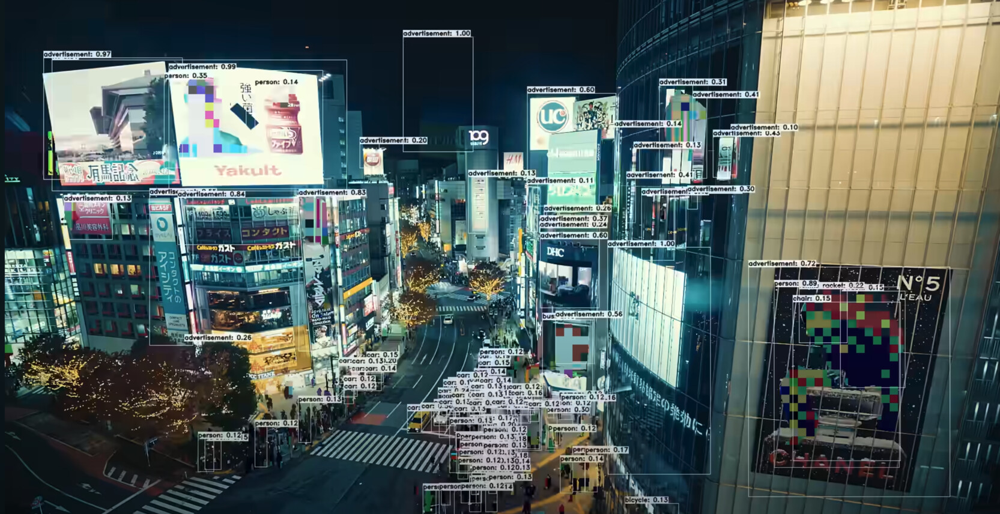

<iframe src="https://www.google.com/maps/embed?pb=!4v1757852051893!6m8!1m7!1syYZmXiJQWe14IElbdpOYuw!2m2!1d35.65965971674801!2d139.7006541695955!3f260.9!4f12.909999999999997!5f0.7820865974627469" width="600" height="450" style="border:0;" allowfullscreen="" loading="lazy" referrerpolicy="no-referrer-when-downgrade"></iframe>

## 0:46 渋谷駅地下

画面左のロッカーが目印。

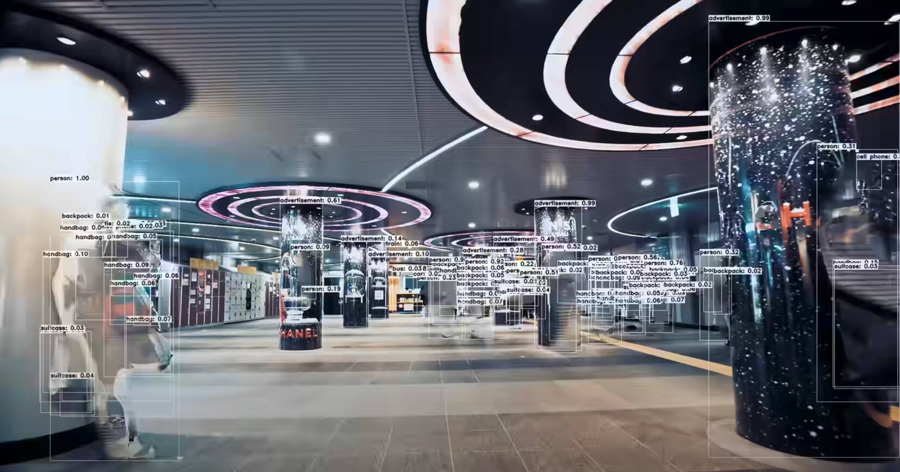

<iframe src="https://www.google.com/maps/embed?pb=!4v1757852113683!6m8!1m7!1sZeDTFiHjNw8msGmN2tdF5w!2m2!1d35.65941809692455!2d139.7015360449702!3f68.13!4f1.0300000000000011!5f0.7820865974627469" width="600" height="450" style="border:0;" allowfullscreen="" loading="lazy" referrerpolicy="no-referrer-when-downgrade"></iframe>

## 0:49 渋谷駅地下

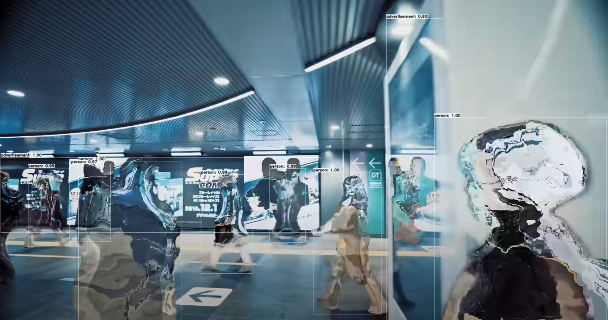

<iframe src="https://www.google.com/maps/embed?pb=!4v1757852225177!6m8!1m7!1sCQp681jhMCaH2Vt3emSBqw!2m2!1d35.65940701281402!2d139.7012000129853!3f177.16!4f-8.120000000000005!5f0.7820865974627469" width="600" height="450" style="border:0;" allowfullscreen="" loading="lazy" referrerpolicy="no-referrer-when-downgrade"></iframe>

## 0:51 旧原宿駅？

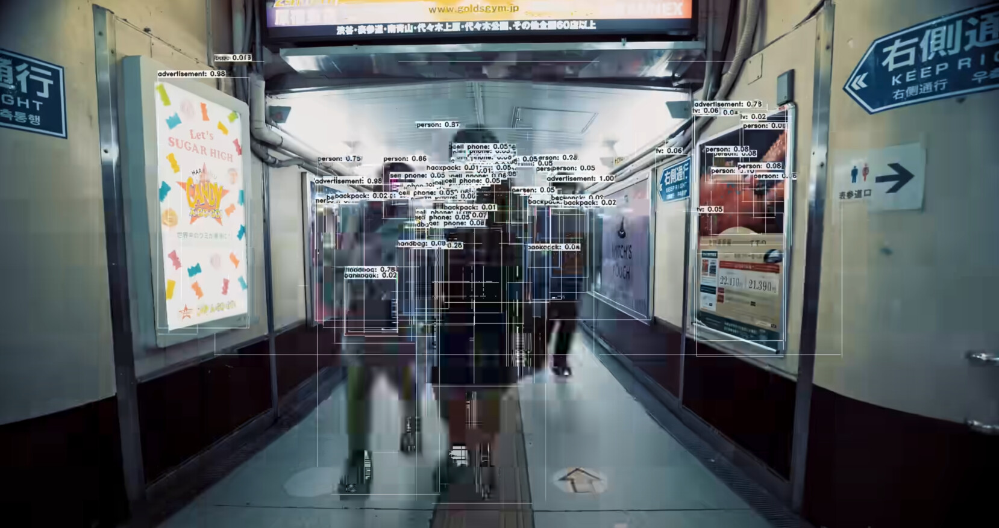

## 0:57 品川・山手線ホーム

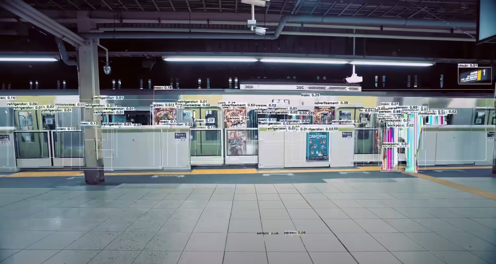

<iframe src="https://www.google.com/maps/embed?pb=!4v1757852563395!6m8!1m7!1s5BDFb-6K4VVb589Jxpw0Ng!2m2!1d35.62754711733309!2d139.7385483205663!3f267.3738906053089!4f-1.7616355068009!5f0.7820865974627469" width="600" height="450" style="border:0;" allowfullscreen="" loading="lazy" referrerpolicy="no-referrer-when-downgrade"></iframe>

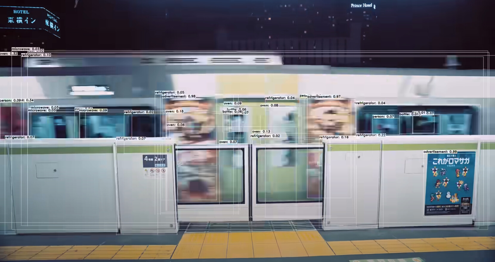

<iframe src="https://www.google.com/maps/embed?pb=!4v1757852600977!6m8!1m7!1s_Pks81cRn-DgOTXgp-GrSw!2m2!1d35.6275125449927!2d139.738453364935!3f267.41415211714775!4f2.839519538360861!5f0.7820865974627469" width="600" height="450" style="border:0;" allowfullscreen="" loading="lazy" referrerpolicy="no-referrer-when-downgrade"></iframe>

## 1:05 品川・山手線ホーム (別アングル)

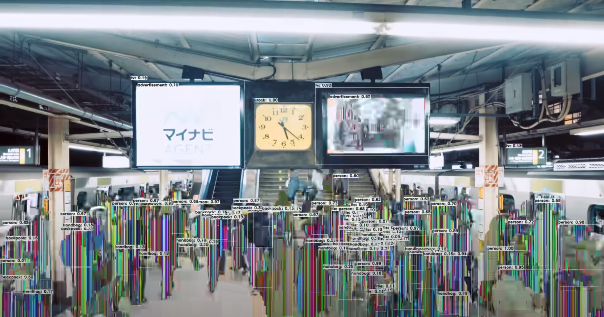

<iframe src="https://www.google.com/maps/embed?pb=!4v1757852673911!6m8!1m7!1s_Pks81cRn-DgOTXgp-GrSw!2m2!1d35.6275125449927!2d139.738453364935!3f41.39!4f4.140000000000001!5f2.3720148119057534" width="600" height="450" style="border:0;" allowfullscreen="" loading="lazy" referrerpolicy="no-referrer-when-downgrade"></iframe>

## 1:08 渋谷・センター街を横断歩道向こうから

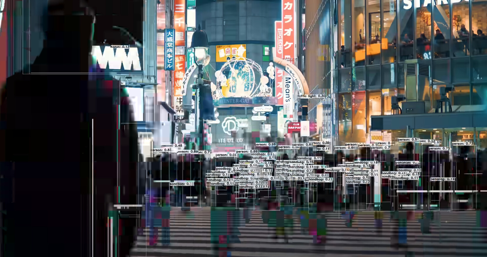

<iframe src="https://www.google.com/maps/embed?pb=!4v1757852713167!6m8!1m7!1s9mwNNC5cs7gslMAv9D0BGg!2m2!1d35.65936113534202!2d139.700755920779!3f314.09!4f1.9699999999999989!5f3.325193203789971" width="600" height="450" style="border:0;" allowfullscreen="" loading="lazy" referrerpolicy="no-referrer-when-downgrade"></iframe>

## 1:10 渋谷・センター街

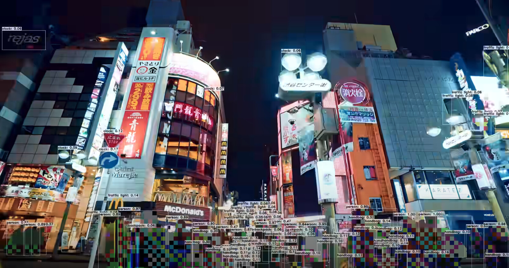

<iframe src="https://www.google.com/maps/embed?pb=!4v1757852865028!6m8!1m7!1sFQmS5VbEw99NCSauYFDWMA!2m2!1d35.66034602032884!2d139.6987471853419!3f300.43!4f18.47!5f1.3727738877652456" width="600" height="450" style="border:0;" allowfullscreen="" loading="lazy" referrerpolicy="no-referrer-when-downgrade"></iframe>

## 1:15 渋谷・神南一丁目

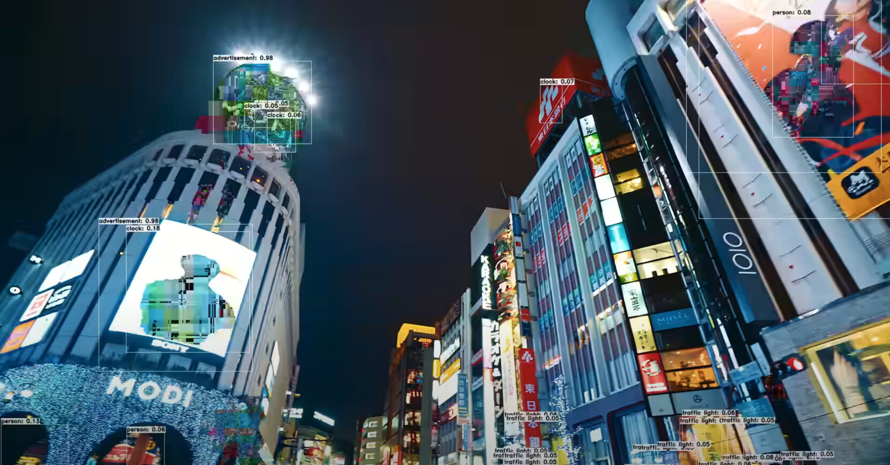

<iframe src="https://www.google.com/maps/embed?pb=!4v1757852919360!6m8!1m7!1sGU2YrkYJSNYSnzv1pic8XA!2m2!1d35.66090306440116!2d139.7008598536387!3f2.47!4f28.78!5f1.2099795838956164" width="600" height="450" style="border:0;" allowfullscreen="" loading="lazy" referrerpolicy="no-referrer-when-downgrade"></iframe>

## 1:20 渋谷駅東急百貨店東横店（解体済み）

既に現存していない。懐かしいですね。

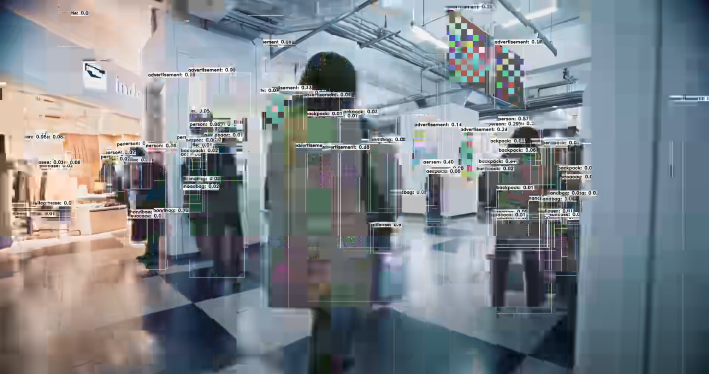

## 1:26 ABC-MART 原宿店のシャッター

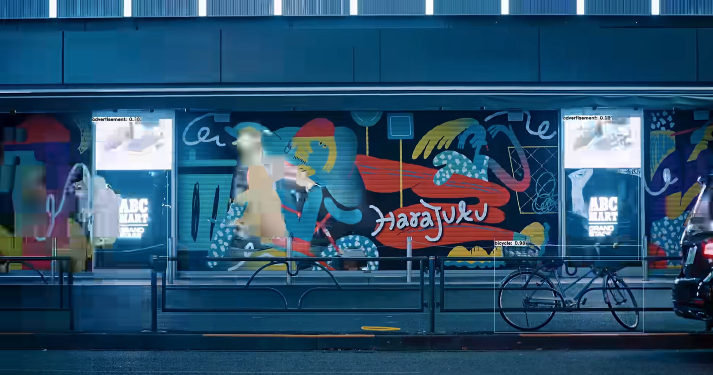

<iframe src="https://www.google.com/maps/embed?pb=!4v1757853069723!6m8!1m7!1seOYR6ZX8th9ZVPBSMuu61g!2m2!1d35.66929522467233!2d139.7060635082392!3f303.51!4f-3.5600000000000023!5f2.3459221335514213" width="600" height="450" style="border:0;" allowfullscreen="" loading="lazy" referrerpolicy="no-referrer-when-downgrade"></iframe>

## 1:28 原宿・神宮前交差点付近

### 当時

<iframe src="https://www.google.com/maps/embed?pb=!4v1757853170569!6m8!1m7!1shjXaouEc3B7XI9KldiQnmA!2m2!1d35.66814692238257!2d139.7050678853961!3f344.5!4f9.670000000000002!5f1.1549258513098983" width="600" height="450" style="border:0;" allowfullscreen="" loading="lazy" referrerpolicy="no-referrer-when-downgrade"></iframe>

### 現在

<iframe src="https://www.google.com/maps/embed?pb=!4v1757853199522!6m8!1m7!1sl5MJa99F2li0rsNzlgHNOg!2m2!1d35.66812009064897!2d139.7050490296548!3f341.58!4f16.310000000000002!5f0.7820865974627469" width="600" height="450" style="border:0;" allowfullscreen="" loading="lazy" referrerpolicy="no-referrer-when-downgrade"></iframe>

## 1:31 渋谷駅東急線改札付近？

https://store.newbalance.co.jp/press/2024/p-67060

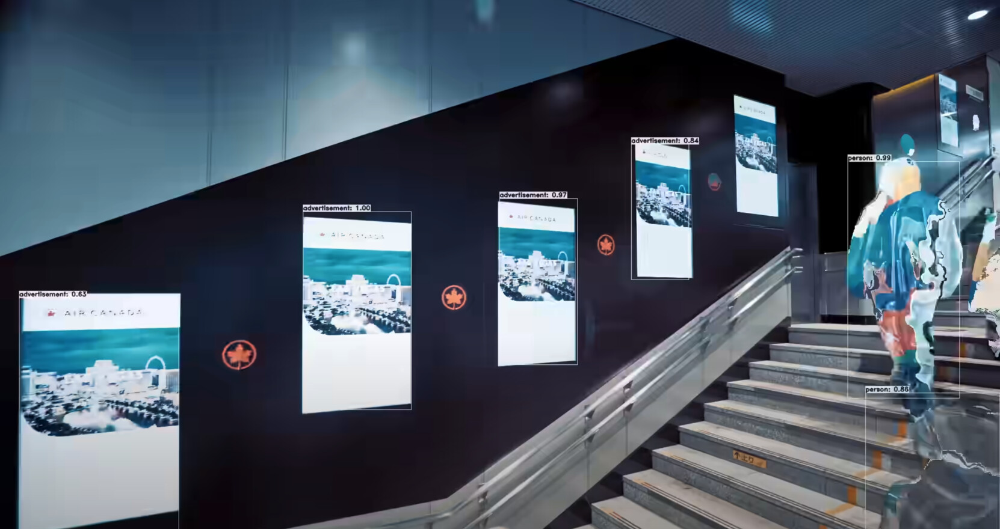

## 1:36 どこ？

## 1:42 どこ？

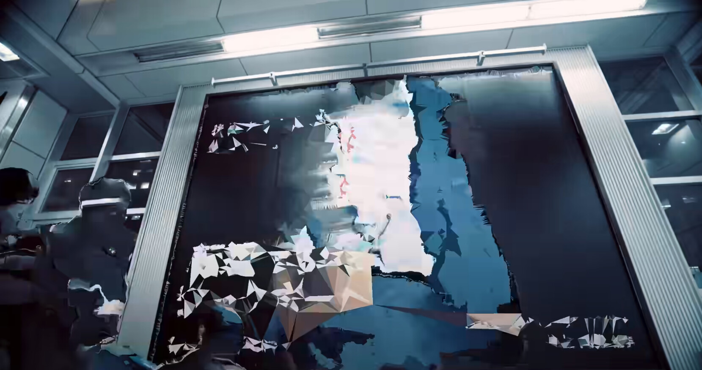

## 1:43 渋谷・スクランブル交差点付近

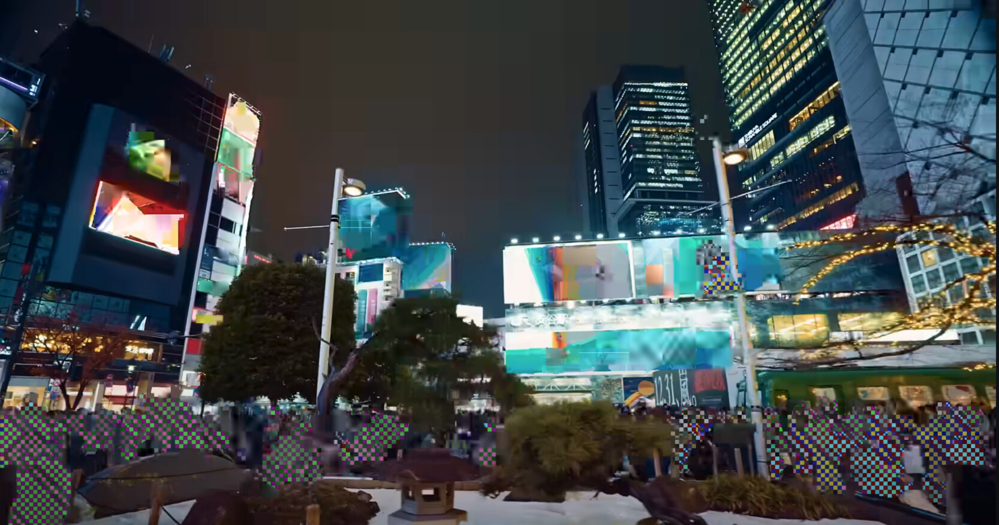

<iframe src="https://www.google.com/maps/embed?pb=!4v1757854023540!6m8!1m7!1smnpVwCphjuQT9x33gGQ5lQ!2m2!1d35.65929431271295!2d139.7005574827602!3f81.25!4f15.959999999999994!5f0.7820865974627469" width="600" height="450" style="border:0;" allowfullscreen="" loading="lazy" referrerpolicy="no-referrer-when-downgrade"></iframe>

## 1:47 原宿・原宿通り

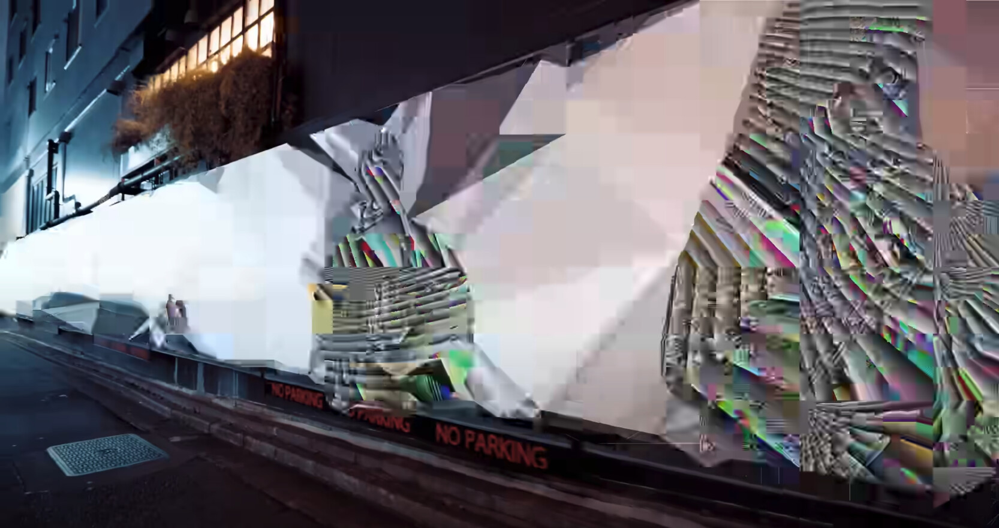

<iframe src="https://www.google.com/maps/embed?pb=!4v1757854394694!6m8!1m7!1sMb19GwlJXQUdOCjZXJPVig!2m2!1d35.67185751611749!2d139.7086120922949!3f283.8!4f-16.980000000000004!5f0.7820865974627469" width="600" height="450" style="border:0;" allowfullscreen="" loading="lazy" referrerpolicy="no-referrer-when-downgrade"></iframe>

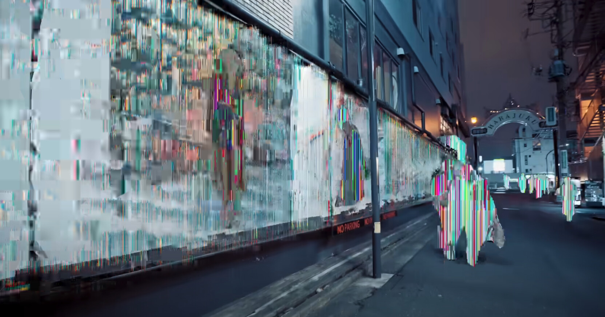

<iframe src="https://www.google.com/maps/embed?pb=!4v1757854462576!6m8!1m7!1sG2K-eLaDn2CrdfOIpLippA!2m2!1d35.67165438065243!2d139.7084363807793!3f30.476800503159065!4f4.776381291597687!5f2.1664469660235297" width="600" height="450" style="border:0;" allowfullscreen="" loading="lazy" referrerpolicy="no-referrer-when-downgrade"></iframe>

## 1:56 原宿・原宿通り入り口

照明、監視カメラは最近撤去された。

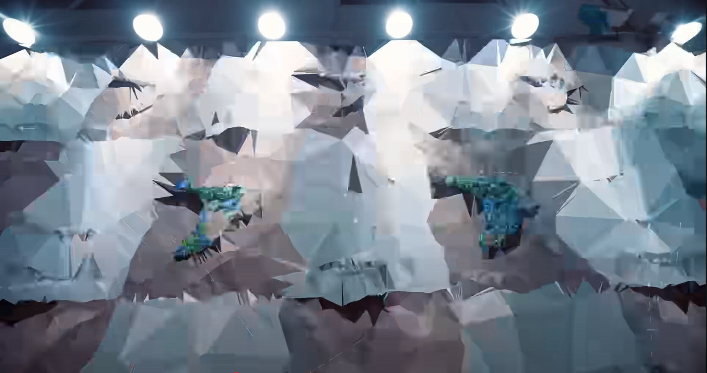

<iframe src="https://www.google.com/maps/embed?pb=!4v1757854570077!6m8!1m7!1sLpltutfKBCB7Ck-ernyQmA!2m2!1d35.6704130397242!2d139.7070925750589!3f306.44!4f24.810000000000002!5f0.7820865974627469" width="600" height="450" style="border:0;" allowfullscreen="" loading="lazy" referrerpolicy="no-referrer-when-downgrade"></iframe>

## 2:03 タクシー車内（どこを走っている？）

## 2:14 六本木ヒルズ・森タワー

<iframe src="https://www.google.com/maps/embed?pb=!4v1757859054125!6m8!1m7!1sCKbxjAwpxm5f3gJpcQ6ggQ!2m2!1d35.66156125917163!2d139.7295286043731!3f181.01!4f20.319999999999993!5f0.7820865974627469" width="600" height="450" style="border:0;" allowfullscreen="" loading="lazy" referrerpolicy="no-referrer-when-downgrade"></iframe>

## 2:19 品川駅 南口

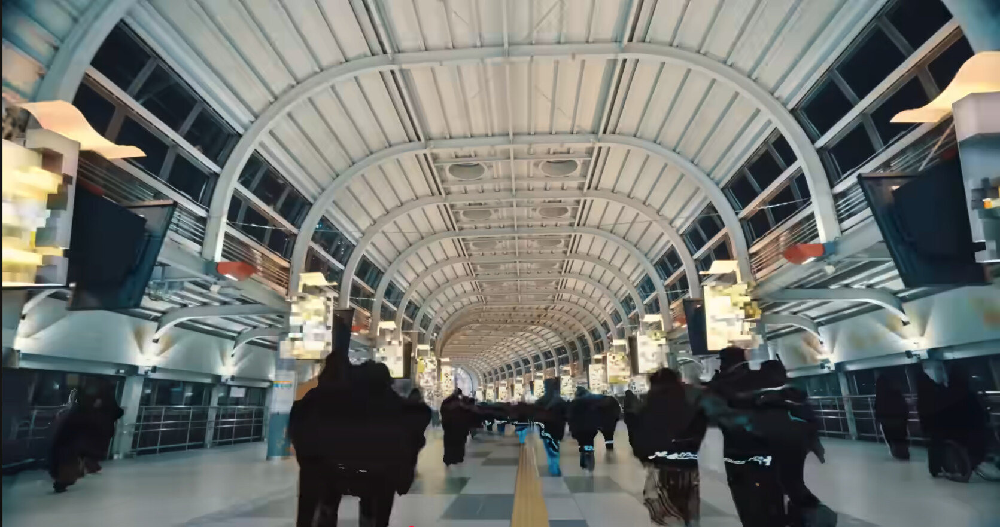

<iframe src="https://www.google.com/maps/embed?pb=!4v1757859127754!6m8!1m7!1sSClhUz_508Zsede8AyDD6Q!2m2!1d35.62899636084391!2d139.7399636296657!3f268.12!4f15.549999999999997!5f0.7820865974627469" width="600" height="450" style="border:0;" allowfullscreen="" loading="lazy" referrerpolicy="no-referrer-when-downgrade"></iframe>

## 2:22 六本木ヒルズ・メトロハット外周

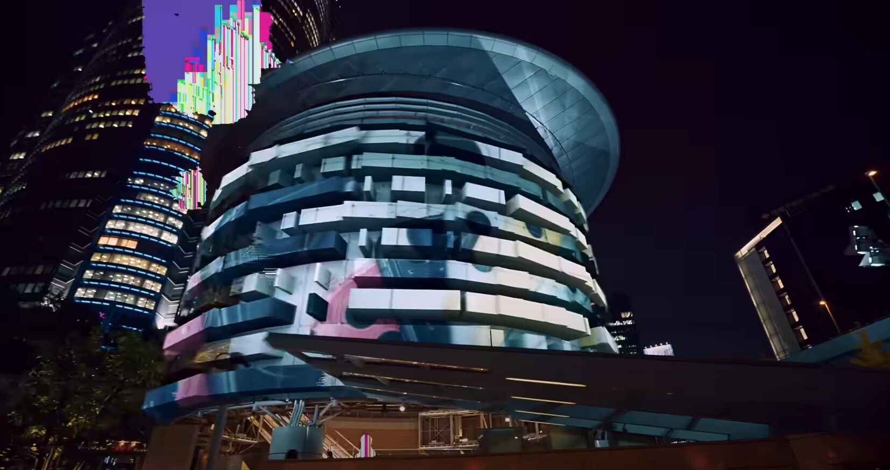

## 2:25 不明

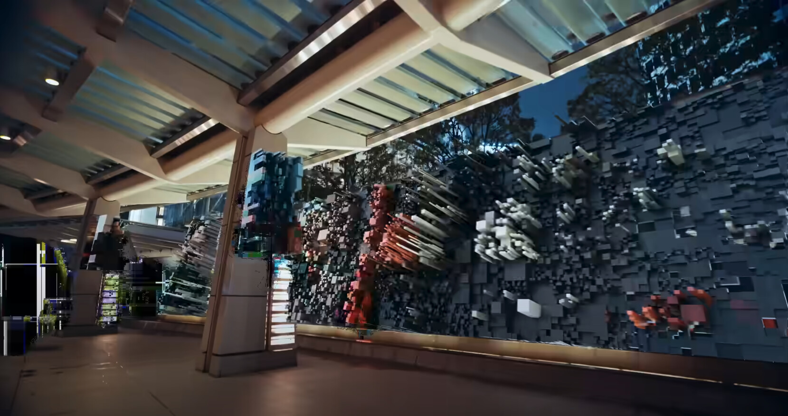

## 2:30 渋谷・センター街

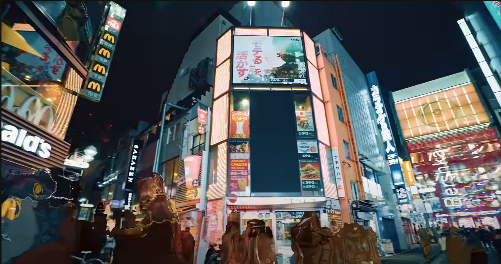

<iframe src="https://www.google.com/maps/embed?pb=!4v1757859275311!6m8!1m7!1sskUF6dDB9WFzNwaURrfimw!2m2!1d35.66039427254948!2d139.6985601285884!3f340.62!4f20.650000000000006!5f0.7820865974627469" width="600" height="450" style="border:0;" allowfullscreen="" loading="lazy" referrerpolicy="no-referrer-when-downgrade"></iframe>

## 2:35 渋谷アディダス (2024/12 改装中) から文化村通りを西へ ABCMart あたりまで

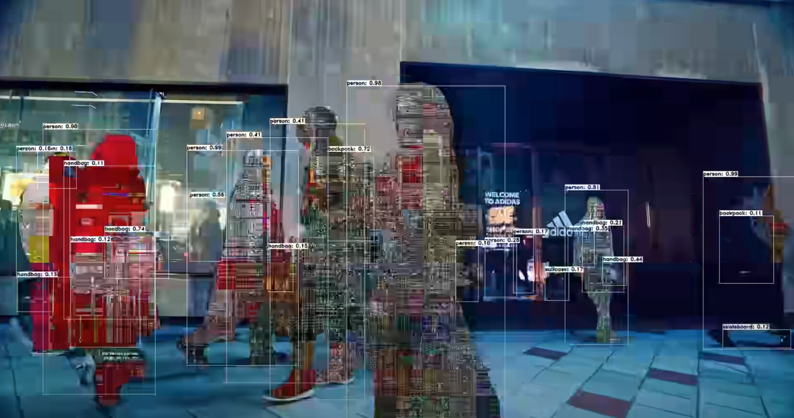

<iframe src="https://www.google.com/maps/embed?pb=!4v1757859337380!6m8!1m7!1shVCimuTdU5Eb0ekIN0kVgg!2m2!1d35.65967108612098!2d139.6991813680829!3f24.13!4f1.5!5f2.1645620946381072" width="600" height="450" style="border:0;" allowfullscreen="" loading="lazy" referrerpolicy="no-referrer-when-downgrade"></iframe>

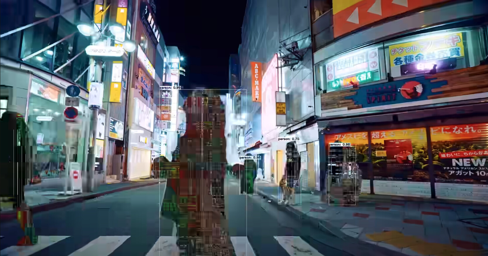

<iframe src="https://www.google.com/maps/embed?pb=!4v1757859395348!6m8!1m7!1sVYFY1tJoQvwLAOXbo9fIXQ!2m2!1d35.6600163304387!2d139.6983565560423!3f28.9!4f1.2199999999999989!5f1.069979667110141" width="600" height="450" style="border:0;" allowfullscreen="" loading="lazy" referrerpolicy="no-referrer-when-downgrade"></iframe>

## 2:40 渋谷・文化村通りを少し進んだあたり (東急百貨店本店は潰れた) から東急あたりを右折し井の頭通りまで

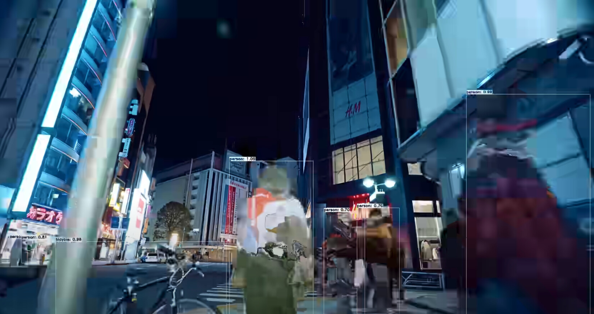

<iframe src="https://www.google.com/maps/embed?pb=!4v1757859453588!6m8!1m7!1s8RI5_jnejPWZ-eI_q3qgKQ!2m2!1d35.66029912760808!2d139.6976036631301!3f306.99!4f12.870000000000005!5f0.7353529048600643" width="600" height="450" style="border:0;" allowfullscreen="" loading="lazy" referrerpolicy="no-referrer-when-downgrade"></iframe>

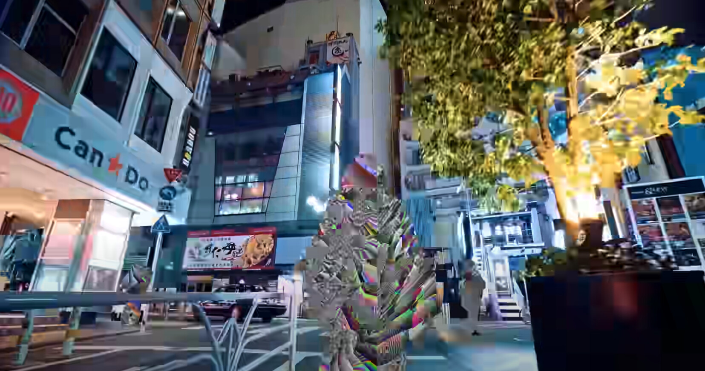

<iframe src="https://www.google.com/maps/embed?pb=!4v1757859502885!6m8!1m7!1s3FcK2O7VXyaUTyg3Qmmzsg!2m2!1d35.6616826354981!2d139.697594392261!3f58.8!4f14.560000000000002!5f0.9410281054225956" width="600" height="450" style="border:0;" allowfullscreen="" loading="lazy" referrerpolicy="no-referrer-when-downgrade"></iframe>

## 2:46 渋谷・宮益坂下交差点付近

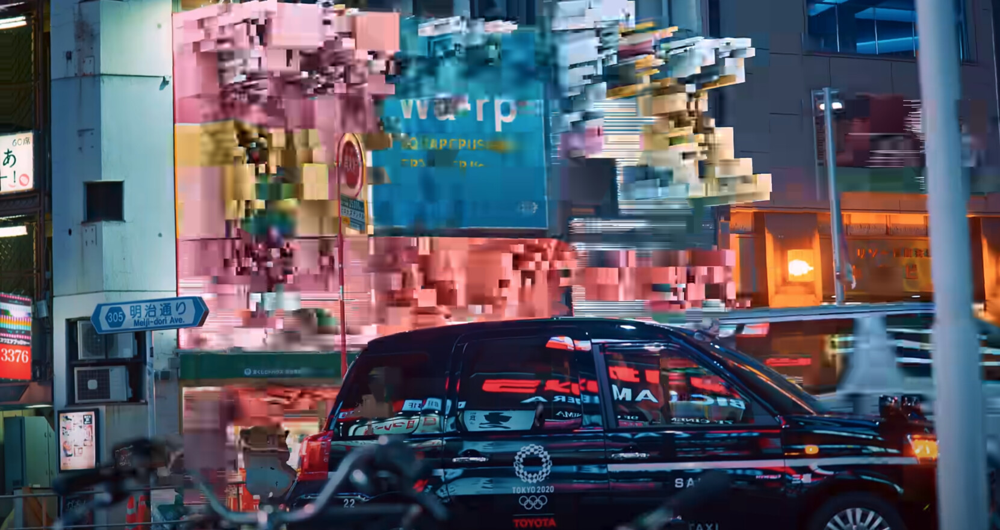

<iframe src="https://www.google.com/maps/embed?pb=!4v1757859550760!6m8!1m7!1sbMVfnUECXsQyXcL-m4HnNQ!2m2!1d35.65969349576828!2d139.7023439163671!3f57.62!4f4.6200000000000045!5f2.3511077222892354" width="600" height="450" style="border:0;" allowfullscreen="" loading="lazy" referrerpolicy="no-referrer-when-downgrade"></iframe>

## 2:48 渋谷・宮益坂下交差点付近から渋谷スクランブルスクエアを見る

おそらく前のカットと同じ場所からアングルを変えただけ。

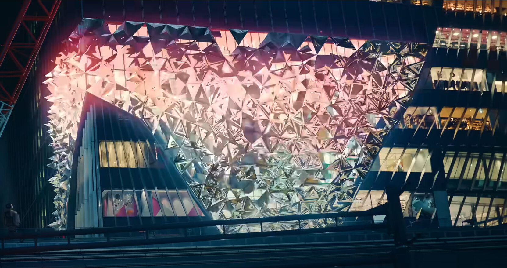

<iframe src="https://www.google.com/maps/embed?pb=!4v1757859630754!6m8!1m7!1s30cia9LYYQLn7uK3KiQb4g!2m2!1d35.65960879944235!2d139.7023722766011!3f190.31!4f18.620000000000005!5f1.8817596243290082" width="600" height="450" style="border:0;" allowfullscreen="" loading="lazy" referrerpolicy="no-referrer-when-downgrade"></iframe>

## 2:52 渋谷・スクランブル交差点

渋谷駅前ビル（固有名詞）の広告を中心に。ビル高層階から撮影

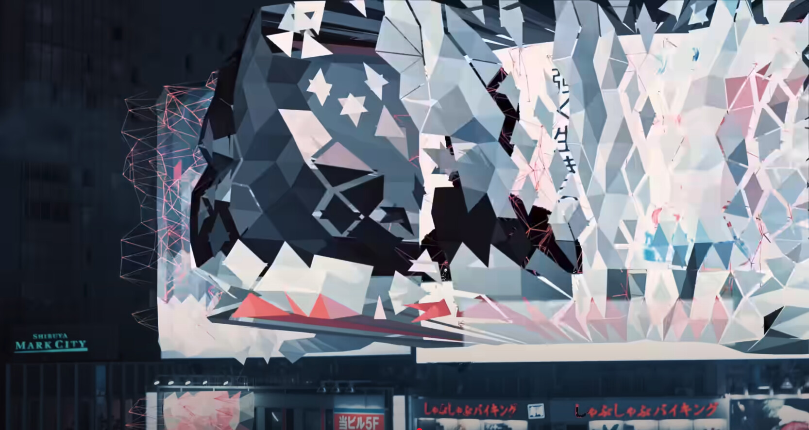

<iframe src="https://www.google.com/maps/embed?pb=!4v1757859698491!6m8!1m7!1s3FpdP_uxn6BPDtsl0qq-CA!2m2!1d35.65949283747957!2d139.7007558428684!3f242.79!4f30.849999999999994!5f2.0261338898074794" width="600" height="450" style="border:0;" allowfullscreen="" loading="lazy" referrerpolicy="no-referrer-when-downgrade"></iframe>

## 2:56 渋谷・スクランブル交差点

ビル高層階から撮影

<iframe src="https://www.google.com/maps/embed?pb=!4v1757859791105!6m8!1m7!1sXVJVifnGo2nWMynwQxUtJg!2m2!1d35.65948331336528!2d139.7007990832788!3f293.95!4f16.060000000000002!5f1.9545793729916014" width="600" height="450" style="border:0;" allowfullscreen="" loading="lazy" referrerpolicy="no-referrer-when-downgrade"></iframe>

## 3:03 JR品川駅 中央改札内

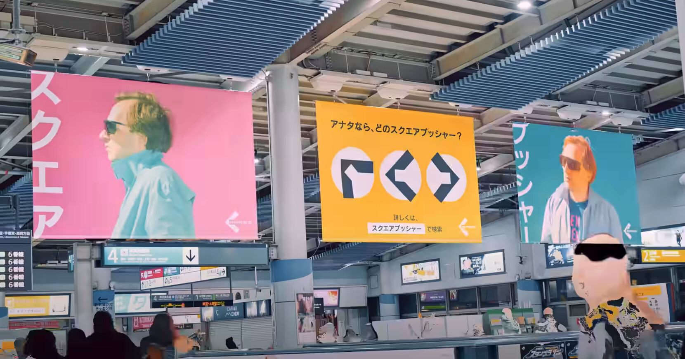

<iframe src="https://www.google.com/maps/embed?pb=!4v1757859863204!6m8!1m7!1sB0JkFFC8BoMM4A0BnA3eiA!2m2!1d35.62873901420008!2d139.7386888052848!3f213.82!4f3.930000000000007!5f2.169216620598844" width="600" height="450" style="border:0;" allowfullscreen="" loading="lazy" referrerpolicy="no-referrer-when-downgrade"></iframe>

## 3:06 JR品川駅 中央改札外

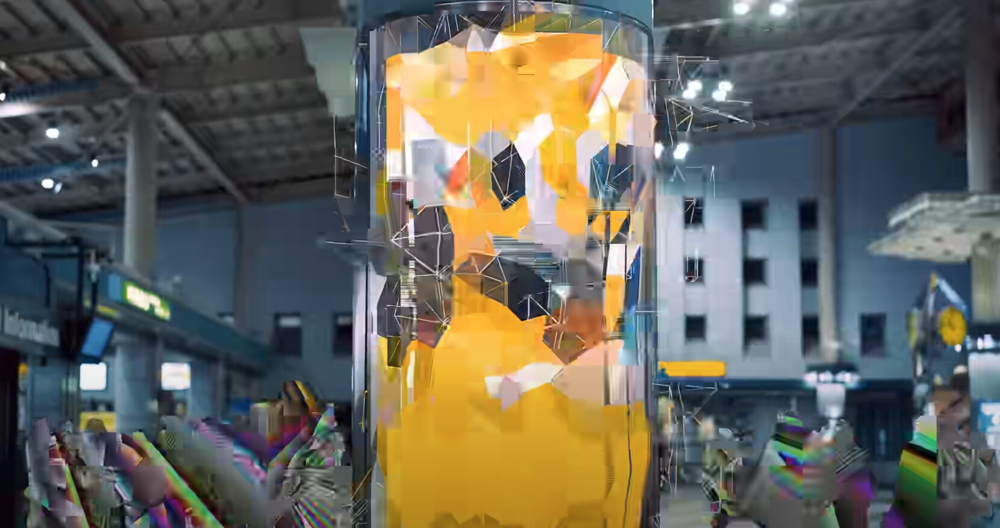

<iframe src="https://www.google.com/maps/embed?pb=!4v1757859937964!6m8!1m7!1s0FWMRFGePrFj3uN3eib0Pw!2m2!1d35.62882496159191!2d139.7387916353204!3f277.42!4f12.439999999999998!5f1.4358377235149704" width="600" height="450" style="border:0;" allowfullscreen="" loading="lazy" referrerpolicy="no-referrer-when-downgrade"></iframe>

## 3:07 原宿・神宮前交差点付近

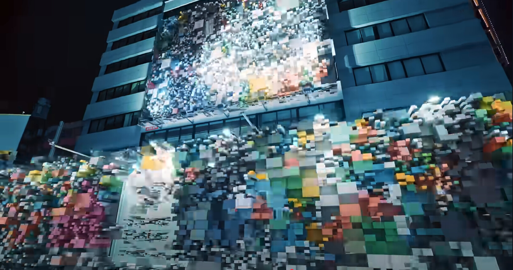

<iframe src="https://www.google.com/maps/embed?pb=!4v1757860099643!6m8!1m7!1s6vgfEpSPELOTi0idA_sCPQ!2m2!1d35.66821235543713!2d139.7051077006383!3f299.69!4f22.549999999999997!5f1.3696634660678475" width="600" height="450" style="border:0;" allowfullscreen="" loading="lazy" referrerpolicy="no-referrer-when-downgrade"></iframe>

## 3:10 渋谷駅地下のどこか

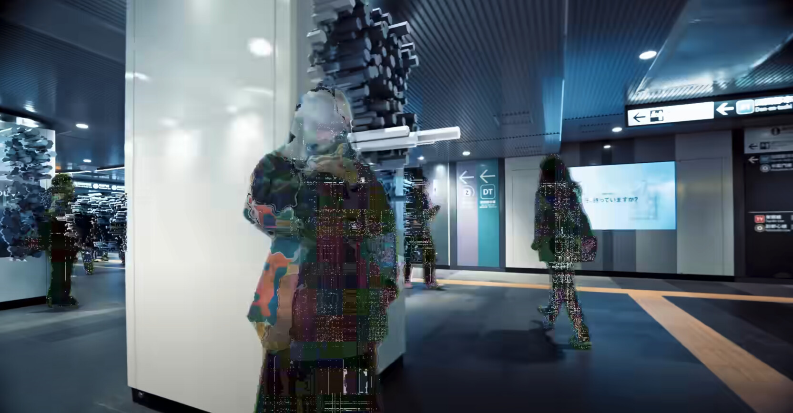

## 3:14 品川駅・みどりの窓口付近

<iframe src="https://www.google.com/maps/embed?pb=!4v1757860188584!6m8!1m7!1sz1nsSiIMXud6nO8nBbijlQ!2m2!1d35.62886553247912!2d139.738829368297!3f339.09!4f9.840000000000003!5f1.5039353692599593" width="600" height="450" style="border:0;" allowfullscreen="" loading="lazy" referrerpolicy="no-referrer-when-downgrade"></iframe>

## 3:21 五反田駅・山手線ホーム

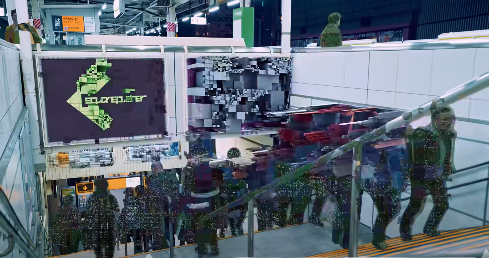

<iframe src="https://www.google.com/maps/embed?pb=!4v1757860419188!6m8!1m7!1sjyvUhEato1i6r0V0hjUqAg!2m2!1d35.62649066281756!2d139.7234921911075!3f162.16224640237044!4f-11.50371313092522!5f2.299968626952992" width="600" height="450" style="border:0;" allowfullscreen="" loading="lazy" referrerpolicy="no-referrer-when-downgrade"></iframe>

## 3:28 大崎駅・2番線停車中の山手線車内

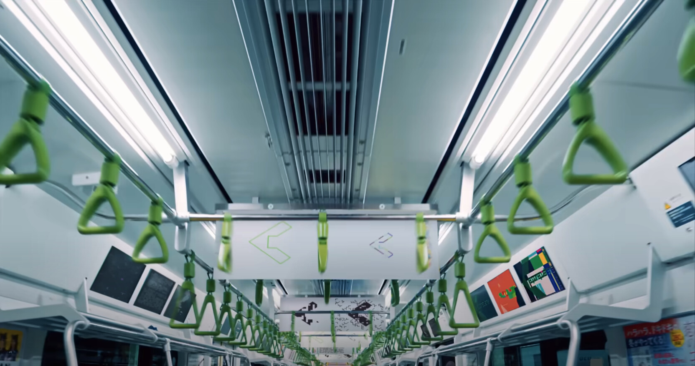

多分、大崎止まりの電車で撮影している。

## 3:39 アングルが変わっただけ？

窓から見える風景で判断できる？

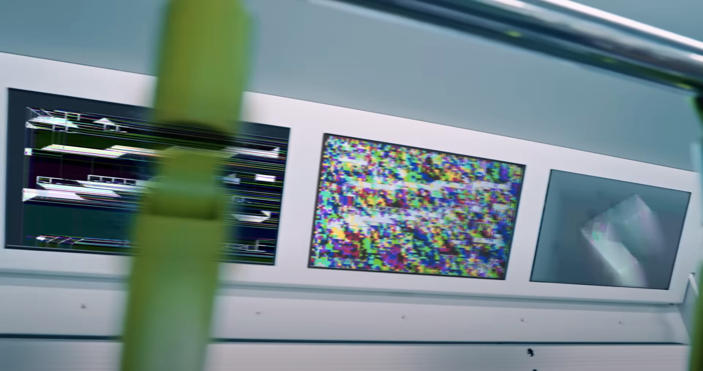

## 3:51 目黒・恵比寿駅間の外回り山手線

2号車 3番ドアらしい。

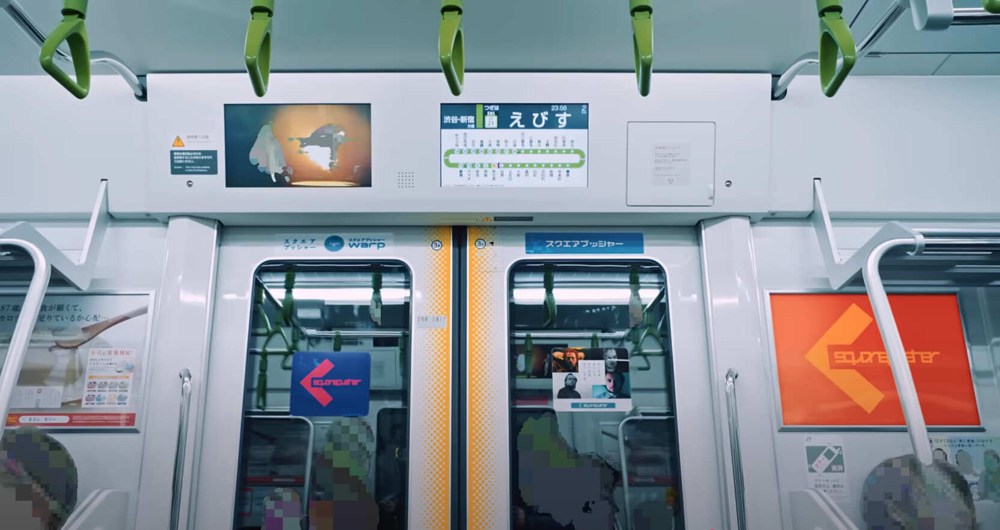

## 4:00 品川駅 新幹線のりば（南口）付近

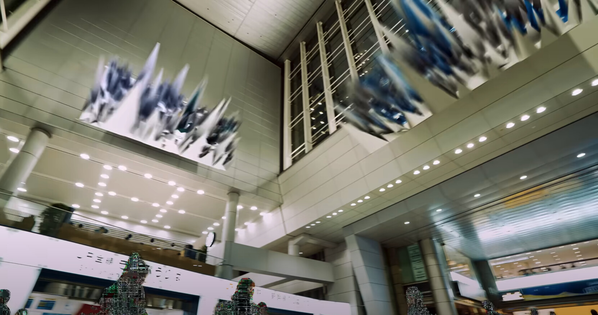

<iframe src="https://www.google.com/maps/embed?pb=!4v1757860736756!6m8!1m7!1sSClhUz_508Zsede8AyDD6Q!2m2!1d35.62899636084391!2d139.7399636296657!3f67.79!4f9.659999999999997!5f1.251237528937733" width="600" height="450" style="border:0;" allowfullscreen="" loading="lazy" referrerpolicy="no-referrer-when-downgrade"></iframe>

## 4:11 渋谷・センター街

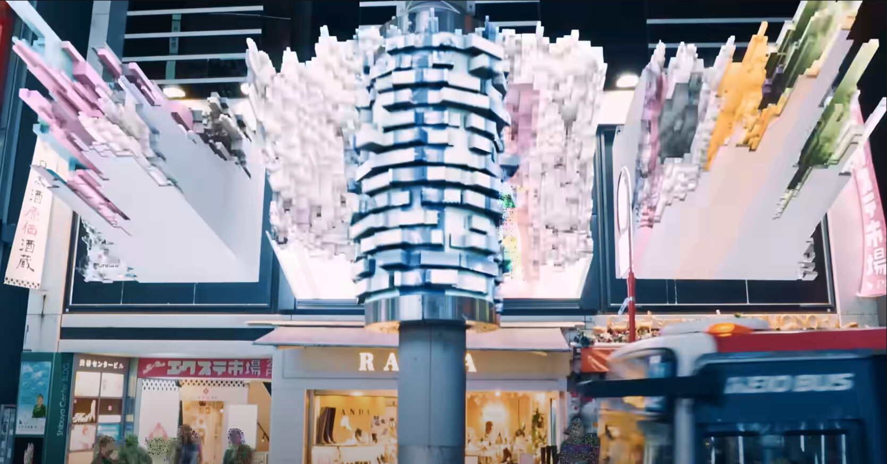

<iframe src="https://www.google.com/maps/embed?pb=!4v1757860797427!6m8!1m7!1suCzZMeLZQc4f4rB6P0xweA!2m2!1d35.66072373057742!2d139.6990010879791!3f359.95!4f7.760000000000005!5f0.7820865974627469" width="600" height="450" style="border:0;" allowfullscreen="" loading="lazy" referrerpolicy="no-referrer-when-downgrade"></iframe>

## 4:16 渋谷・センター街

<iframe src="https://www.google.com/maps/embed?pb=!4v1757860835329!6m8!1m7!1sTr3jZOOylEcxP8vDf7AjPw!2m2!1d35.6609184767403!2d139.6984247251101!3f226.24!4f17.97!5f0.7820865974627469" width="600" height="450" style="border:0;" allowfullscreen="" loading="lazy" referrerpolicy="no-referrer-when-downgrade"></iframe>

## 4:22 渋谷・センター街

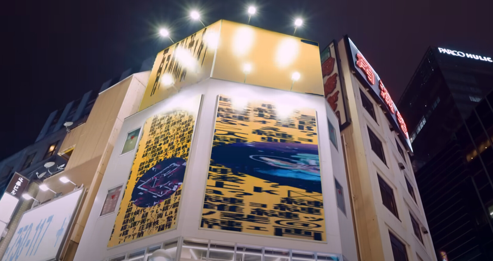

<iframe src="https://www.google.com/maps/embed?pb=!4v1757860905477!6m8!1m7!1sLKx0y2zIFD2le6Vgkyre5w!2m2!1d35.66100532223449!2d139.6979814328068!3f346.76!4f37.83!5f1.5039353692599593" width="600" height="450" style="border:0;" allowfullscreen="" loading="lazy" referrerpolicy="no-referrer-when-downgrade"></iframe>

## 4:32 渋谷・MEGAドンキ渋谷本店

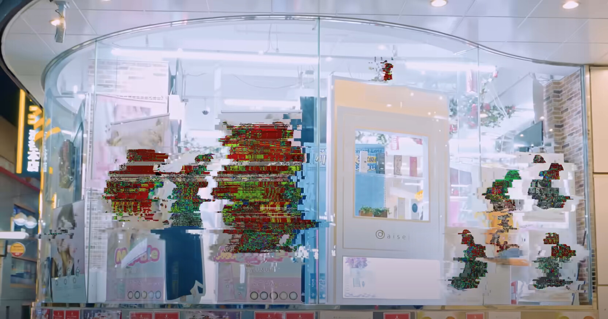

<iframe src="https://www.google.com/maps/embed?pb=!4v1757860991630!6m8!1m7!1sUv094D13rPDcareYGQRdiA!2m2!1d35.66073105296881!2d139.6977259764136!3f143.87!4f-0.5499999999999972!5f1.827026279075283" width="600" height="450" style="border:0;" allowfullscreen="" loading="lazy" referrerpolicy="no-referrer-when-downgrade"></iframe>

## 4:43 渋谷・センター街

CoCo壱、庄やは閉店した模様。

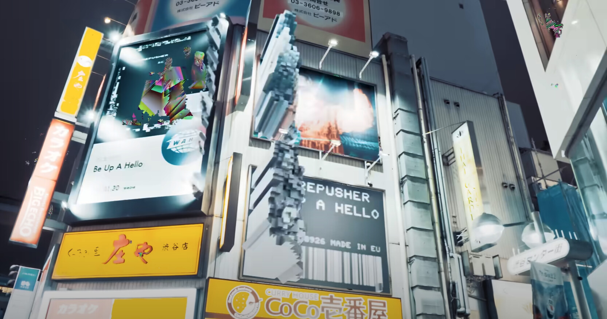

<iframe src="https://www.google.com/maps/embed?pb=!4v1757861050700!6m8!1m7!1sVFa6HipvW5zmzxISlecW1w!2m2!1d35.66065616777302!2d139.6994019275917!3f157.2!4f22.870000000000005!5f1.4712551578813278" width="600" height="450" style="border:0;" allowfullscreen="" loading="lazy" referrerpolicy="no-referrer-when-downgrade"></iframe>

## 4:48 神南一丁目交差点付近

遠くに見える渋谷マルイは建て替え中。

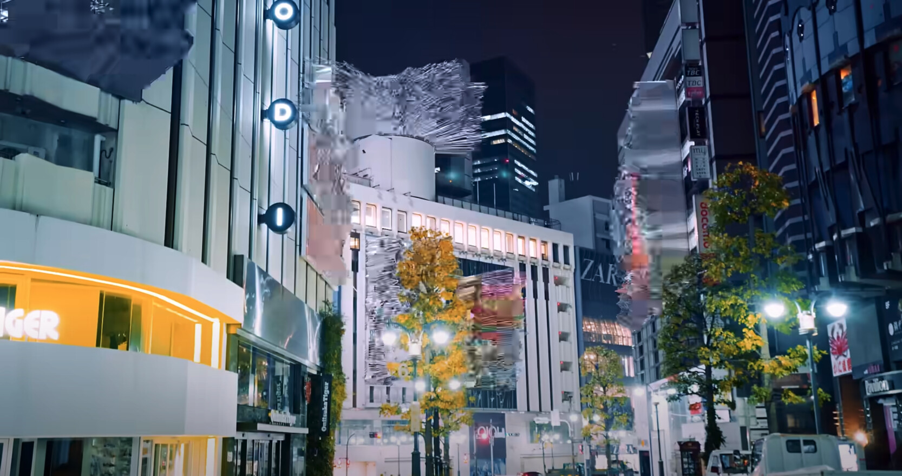

<iframe src="https://www.google.com/maps/embed?pb=!4v1757861142388!6m8!1m7!1sI8yzOEI8dPA9M_UUmxLysg!2m2!1d35.66149898860311!2d139.7001407417143!3f130.37!4f6.260000000000005!5f2.096210218738098" width="600" height="450" style="border:0;" allowfullscreen="" loading="lazy" referrerpolicy="no-referrer-when-downgrade"></iframe>

## 4:54 渋谷・スクランブルスクエアから？（上空）

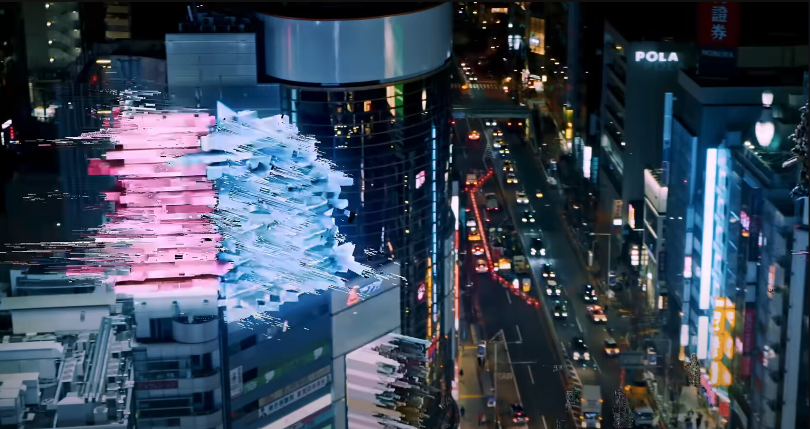

<iframe src="https://www.google.com/maps/embed?pb=!4v1757861205566!6m8!1m7!1siNwiwmurXbop3MZ--v7sXA!2m2!1d35.65954101937514!2d139.7023749256346!3f326.9!4f18.430000000000007!5f0.7820865974627469" width="600" height="450" style="border:0;" allowfullscreen="" loading="lazy" referrerpolicy="no-referrer-when-downgrade"></iframe>

## 5:13 渋谷・スクランブル交差点

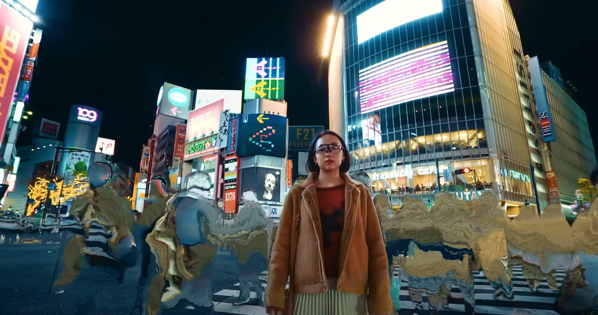

<iframe src="https://www.google.com/maps/embed?pb=!4v1757861229933!6m8!1m7!1sSBd6qDaH0lvi1q6AeG8e8w!2m2!1d35.65937216157128!2d139.7005837385572!3f319.74!4f11.219999999999999!5f0.9061143867615719" width="600" height="450" style="border:0;" allowfullscreen="" loading="lazy" referrerpolicy="no-referrer-when-downgrade"></iframe>
