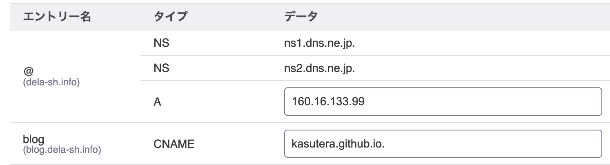

# 本ブログを GitHub Pages に移行した際に設定を間違えた

本ドメイン `blog.dela-sh.info` は、 `dela-sh.info` と同じ Nginx サーバーで運用していました (自前サーバで dev mode で動かしていた) が、今回 本サブドメインのみ GitHub Pages に移行しました。
GitHub Pages を使用するのは初めてだったので、[公式のマニュアル](https://docs.github.com/ja/pages/configuring-a-custom-domain-for-your-github-pages-site/managing-a-custom-domain-for-your-github-pages-site)を読みながら設定を行いましたが、 CNAME レコードの末尾にドットを付け忘れ、しばらくアクセスできない状態になってしまいました。
TTL の関係で、修正してから反映されるまでに 3600 秒ほどかかりましたが、無事アクセスできるようになりました。

↑ `blog.dela-sh.info.` と、末尾に `.` を付けるのが正しい

従来は手動で docker 再起動していたところを、GitHub Actions でのデプロイに移行できたので、更新頻度が上がることが期待されます。
